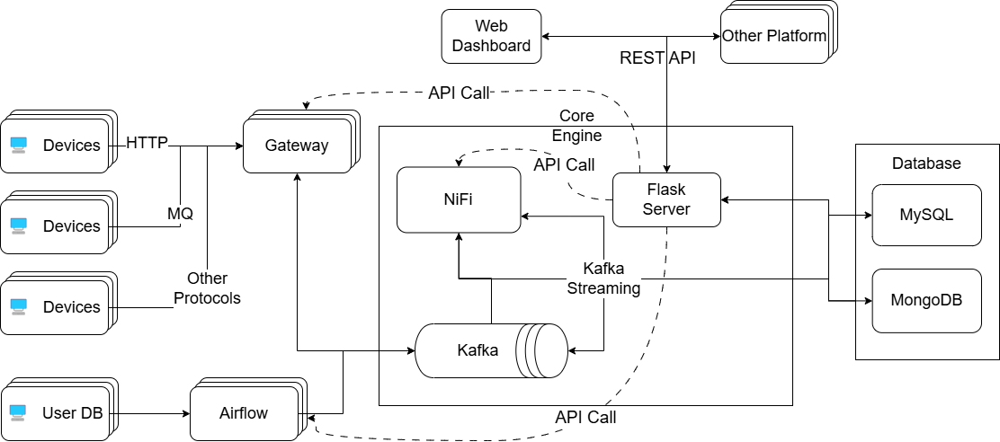

# Encore Playdata DE 과정 최종 프로젝트

## 데이터 플랫폼 구축 프로젝트
이 프로젝트는 데이터 플랫폼을 직접 구축함으로써 데이터 엔지니어링 업무를 경험하고, 이를 통해 데이터 엔지니어로서의 역량을 키우는 것을 목표로 합니다.

## 프로젝트 개요
- 프로젝트 명: 데이터 플랫폼 구축 프로젝트
- 프로젝트 기간: 2024.07.29 ~ 2021.09.30 (9주)
- 프로젝트 목표: 데이터 플랫폼 구축을 통한 데이터 엔지니어링 역량 강화
- 프로젝트 인원: 5명
- 프로젝트 진행 방식: Agile 방법론에 기반한 Scrum 방식

## 프로젝트 팀원
|이름|김하영|김동현|김기호|조태식|기석광|
|---|---|---|---|---|---|
|역할|팀장 설계 및 프론트엔드|백엔드|Kafka|NiFi|Airflow|
<!-- |사진||||||| -->

## 사용 기술 스택
- 데이터베이스: MySQL, MongoDB
- 데이터 엔지니어링 툴: Apache Kafka, Apache Airflow, Apache NiFi
- 서버: Quart(Python)
- 웹: React
- 클라우드: AWS EC2, AWS MSK
- etc: Docker, Git, Linux, Terraform

## 프로젝트 아키텍처

## 프로젝트 진행 상황
 **1주차** : 요구사항 분석 및 아키텍처 설계  
 **2주차** : 아키텍쳐 세부 설계 및 기술 스택 선정  
 **3주차** : 개발환경 구축 및 협업 도구 선정  
 **4주차** : 유저 인터페이스 및 데이터베이스 구축  
 **5주차** : 외부 서비스 구축 및 연동 테스트  
 **6주차** : 외부 서비스를 통한 데이터 수집 및 저장 구현  
 **7주차** : 유저 로직에 따른 데이터 처리 구현  
 **8주차** : 개발 마무리 및 디버깅  
 **9주차** : 발표 및 회고  

## 프로젝트 문서
- [기획안](./산출물/프로젝트_기획안.pdf)
- [요구사항 정의서](./산출물/요구사항정의서_기능요구서.pdf)
- [아키텍처 설계서](./산출물/아키텍쳐_다이어그램.png)
- [발표 자료](./산출물/플레이데이터_최종.pptx)